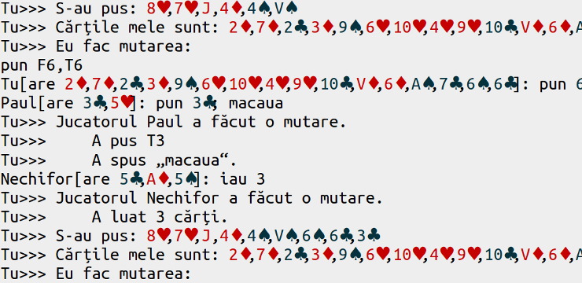

# This repository has been moved to [gitlab.com/paul-nechifor/makawa](http://gitlab.com/paul-nechifor/makawa).

Old readme:

# Makawa

This is a Java implementation of the **Macaua** card game.

## About

I did this back in 2009 when I first started using Java so excuse the bad code
(things like using the Vector class and very long lines).

The game is more advanced than others I've played. The rules of Macaua are very
disputed and I wanted to build a game (with the AI) that can play by any of the
rules you provide with an unlimited number of players and decks. This almost
does that, but the configuration is done in the code.

My intention was to build a GUI client for it, but that never happened and
nobody is going to install Java to play a game. I still think that sometime in
the future I'll do this in HTML5.

The code is both written and commented in Romanian.

The [supported commands][cmds] are in the source code.

## Usage

Build it:

    mvn package

Invoke it as:

    <program> Player1Type Player1Name Player2Type Player2Name ...

where the types are `Human` for console controlled and `Simple` for AI.

For example to play against two bots use:

    java -cp target/makawa-*.jar net.nechifor.makawa.Makawa Human P1 Simple P2 Simple P3

## License

MIT

[cmds]: src/main/java/net/nechifor/makawa/JucatorUmanText.java#L78
